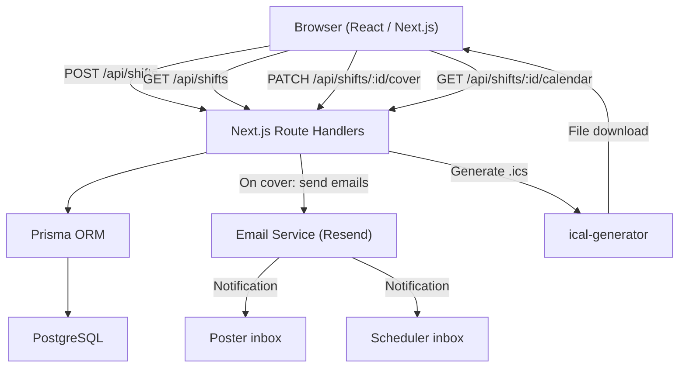

# ShiftSwapper Backend Design

## 1. Overview

This document describes the backend architecture for ShiftSwapper: the data models, API surface, business logic, notification system, calendar invite generation, error handling strategy, and future-proofing considerations. The source requirements live in `shiftswapper.md`.

---

## 2. Tech Stack

| Concern           | Choice                              | Rationale                                                                 |
|-------------------|-------------------------------------|---------------------------------------------------------------------------|
| Runtime           | Node.js + TypeScript                | Ubiquitous, strong typing, large ecosystem                                |
| Framework         | Next.js (App Router + Route Handlers) | Collocates API and React UI; no separate server to deploy for MVP       |
| Database          | PostgreSQL (prod) / SQLite (local)  | Simple relational schema; Prisma makes both interchangeable               |
| ORM               | Prisma                              | Type-safe queries, first-class migration tooling                          |
| Email             | Resend (or SendGrid)                | Transactional email via API; no SMTP configuration needed                 |
| Calendar invites  | ical-generator (npm)                | RFC 5545 compliant .ics generation; works with Outlook, Apple, Google     |
| Validation        | Zod                                 | Schema-first validation; pairs well with TypeScript                       |

---

## 3. Data Model

### 3.1 shifts

The central table. One row per posted shift.

| Column        | Type        | Constraints              | Notes                                         |
|---------------|-------------|--------------------------|-----------------------------------------------|
| id            | UUID        | PK, DEFAULT gen_random_uuid() |                                          |
| poster_name   | VARCHAR     | NOT NULL                 |                                               |
| poster_email  | VARCHAR     | NOT NULL                 | Never exposed to the browser                  |
| poster_phone  | VARCHAR     | NOT NULL when posting   | Required for SMS; when posted by user, from user.phone (do not collect on post form for logged-in users). |
| location      | VARCHAR     | NOT NULL                 | Validated against the allowed locations list  |
| role          | VARCHAR     | NOT NULL                 | Pharmacist, Technician, or Intern; validated against roles list |
| shift_date    | DATE        | NOT NULL                 |                                               |
| start_time    | TIME        | NOT NULL                 |                                               |
| end_time      | TIME        | NOT NULL                 | Must be after start_time (enforced in API)    |
| status        | VARCHAR     | NOT NULL, DEFAULT 'open' | open / covered / cancelled                    |
| coverer_name  | VARCHAR     | NULL                     | Populated when shift is covered               |
| coverer_email | VARCHAR     | NULL                     | Populated when shift is covered               |
| coverer_phone | VARCHAR     | NULL                     | Populated when shift is covered (from session when authenticated); used in SMS to poster |
| posted_by_user_id | UUID     | NULL, FK → users(id)     | Set when shift is posted by a logged-in user  |
| created_at    | TIMESTAMPTZ | NOT NULL, DEFAULT now()  |                                               |
| covered_at    | TIMESTAMPTZ | NULL                     | Populated when shift is covered               |

### 3.2 settings

A single-row configuration table.

| Column          | Type        | Notes                                          |
|-----------------|-------------|------------------------------------------------|
| id              | UUID        | PK                                             |
| scheduler_email | VARCHAR     | Receives coverage notification emails          |
| timezone        | VARCHAR     | DEFAULT 'America/Chicago'; used for .ics files |
| created_at      | TIMESTAMPTZ |                                                |
| updated_at      | TIMESTAMPTZ |                                                |

For MVP this row is seeded manually. A future settings UI will allow the admin to update it.

### 3.3 users

Stores signed-up team members and admins. Used for authentication and to pre-fill poster/coverer data.

| Column     | Type        | Constraints              | Notes                                            |
|------------|-------------|--------------------------|--------------------------------------------------|
| id         | UUID        | PK, DEFAULT gen_random_uuid() |                                             |
| first_name | VARCHAR     | NOT NULL                 |                                                  |
| last_name  | VARCHAR     | NOT NULL                 |                                                  |
| email      | VARCHAR     | UNIQUE, NOT NULL         | Login identifier                                 |
| phone      | VARCHAR     | NULL                     | Optional; required when user opts in to SMS at signup; can be added/updated in Account (PATCH /api/me). |
| position   | VARCHAR     | NOT NULL                 | e.g. "Pharmacist"; validated against roles list  |
| role           | VARCHAR     | NOT NULL, DEFAULT 'member' | 'member' or 'admin'                          |
| sms_consent    | BOOLEAN     | NOT NULL, DEFAULT false   | User has agreed to receive SMS for shift swap updates. |
| sms_consent_at | TIMESTAMPTZ | NULL                      | Set when sms_consent was set to true (at signup or later). |
| email_verified | BOOLEAN     | NOT NULL, DEFAULT false   | Set true when user completes email verification (link or token). |
| phone_verified | BOOLEAN     | NOT NULL, DEFAULT false   | Set true when user successfully submits the 6-digit SMS code. |
| created_at     | TIMESTAMPTZ | NOT NULL, DEFAULT now()  |                                                  |
| updated_at     | TIMESTAMPTZ | NOT NULL                 |                                                  |

Optionally store `email_verification_token` and `email_verification_expires_at` for the verification link (per implementation).

Calendar filtering for members is by `position` only: a member sees only shifts where `shift.role` = user's `position`. When `posted_by_user_id` is set on a shift, poster name/email/phone can be stored as a snapshot at post time (so historical shifts stay correct if the user later changes profile) or derived from the user record at read time; document the choice in implementation.

---

## 4. Reference Data

Locations and roles are currently static. They are defined as constants in the codebase (not database rows) for MVP, making them easy to extend later by moving them to a database table.

### Locations

```
Red Pharmacy
CSC Pharmacy
Shapiro Pharmacy
Whittier Pharmacy
Enhanced Care
Speciality Pharmacy
Brooklyn Park Pharmacy
St. Anthony Pharmacy
Richfield Pharmacy
North Loop Pharmacy
```

### Roles / positions

The same list is used for shift `role` and user `position`. Values: Pharmacist, Technician, Intern.

```
Pharmacist
Technician
Intern
```

GET /api/roles returns this list. It is used for the sign-up position dropdown and for shift role validation.

### Pay periods (calendar display only)

Pay periods are two-week blocks used only for calendar display so users can ensure they are swapping shifts within the same pay period. No API or database change: the calendar grid applies a visible gray background (e.g. slate-200) to every other two-week chunk. The period for each cell is derived from that cell’s displayed calendar date (year/month/day) interpreted in UTC, so bands align correctly in all timezones. The first gray block starts March 8 (e.g. March 8–21 = first pay period, March 22–April 4 = second, then alternating). The anchor is fixed (e.g. March 8 of a reference year) so the pattern extends indefinitely in both directions.

---

## 5. API Endpoints

### 5.1 Reference Data

| Method | Path           | Auth Required | Description                        |
|--------|----------------|---------------|------------------------------------|
| GET    | /api/locations | No            | Returns the array of location names |
| GET    | /api/roles     | No            | Returns the array of role names     |

**GET /api/locations response:**
```json
{ "locations": ["Red Pharmacy", "CSC Pharmacy", "..."] }
```

### 5.2 Auth

Use session-based auth (e.g. NextAuth.js with credentials or magic link, or Clerk). Session identifies `user.id` and `user.role`; middleware or session check injects the current user on protected routes.

**Signup flow (with email verification; SMS optional):** Email is required. **Phone is optional** unless the user opts in to SMS: if they check "Get text when your shift is covered?" (**sms_consent** true), **phone is required** and must be valid (e.g. at least 10 digits). After creating the user, send a verification email (Resend) with a link (e.g. /api/auth/verify-email?token=...). The **verify-email** endpoint validates the token, sets `email_verified = true`, then **redirects:** if the user has **sms_consent** true, a **phone** (trimmed length ≥ 10), and **phone_verified** false → redirect to **/verify-phone** (e.g. ?email_verified=1); otherwise redirect to the app (e.g. /calendar). Phone verification (6-digit code) is required **only** when the user has opted in and has a phone but has not yet verified it.

**Access rule:** Protected routes require **email** verification. If `email_verified` is false, redirect to check-email and block app access. **Phone** verification is required **only** when the user has **sms_consent** true, has a **phone** number on file, and **phone_verified** is false—in that case redirect to /verify-phone. Users who did not opt in or have no phone are not redirected to verify-phone.

| Method | Path                 | Auth Required | Description                                                                 |
|--------|----------------------|---------------|-----------------------------------------------------------------------------|
| POST   | /api/auth/signup     | No            | Body: first_name, last_name, email, password (or magic link), position, **phone (optional; required when sms_consent true)**, **sms_consent (boolean)**. Create user with role 'member'; store sms_consent and set sms_consent_at when sms_consent is true. On success: send verification email (Resend) with link; send notification email to admin. Return session or redirect. |
| POST   | /api/auth/login      | No            | Credentials or magic link; establish session.                               |
| POST   | /api/auth/logout     | No            | Clear session.                                                              |
| GET or POST | /api/auth/verify-email | No        | Accept token (query or body); validate and set `email_verified = true`. Redirect: if user has sms_consent and phone (length ≥ 10) and !phone_verified → /verify-phone?email_verified=1; else → /calendar. |
| POST   | /api/auth/send-phone-code | Session  | Sends 6-digit code via Twilio to the user's profile phone; store code and short expiry (e.g. 10 min) in DB or cache. |
| POST   | /api/auth/verify-phone   | Session  | Body: `{ code: string }`. Validate code; if correct, set `phone_verified = true` and return success. |
| GET    | /api/auth/session or /api/me | Session  | Return current user (id, first_name, last_name, email, position, phone, role, sms_consent, sms_consent_at, **email_verified**, **phone_verified**). 401 if unauthenticated. |
| PATCH  | /api/me                 | Session  | Body: `{ sms_consent?: boolean, phone?: string }`. Update SMS consent (set sms_consent_at when true) and/or phone. If phone is provided and valid (e.g. ≥ 10 digits), update user.phone and set phone_verified = false. Used in Account for opt-in/out and to add or update phone. |

### 5.3 Shifts

| Method | Path                      | Auth Required | Description                                          |
|--------|---------------------------|---------------|------------------------------------------------------|
| POST   | /api/shifts               | **Yes**       | Create a new open shift posting; 401 if unauthenticated (see body rules below) |
| GET    | /api/shifts               | No            | List shifts; behavior depends on auth (see below)     |
| GET    | /api/shifts/:id           | No            | Get full details for a single shift                  |
| PATCH  | /api/shifts/:id/cover     | No            | Mark shift as covered; triggers notifications        |
| PATCH  | /api/shifts/:id           | Yes (owner or admin) | Cancel or update shift; 403 if not poster and not admin |
| DELETE | /api/shifts/:id           | Yes (owner or admin) | Remove shift; 403 if not poster and not admin   |
| GET    | /api/shifts/:id/calendar  | No            | Download .ics file for a covered shift               |

#### POST /api/shifts

**Authentication required.** If the request is unauthenticated, return **401 Unauthorized**. Anonymous posting is removed or deprecated.

**When authenticated:** poster_name, poster_email, role (position), and poster_phone come from the session/user profile. Request body: shift_date, start_time, end_time, location only. Do not require or accept poster_phone in the body for authenticated users; use `user.phone` from the profile (collected at signup). Set `posted_by_user_id` to current user. Optionally allow role override in body; otherwise use user.position.

Response (201):
```json
{
  "id": "uuid",
  "status": "open",
  "location": "Shapiro Pharmacy",
  "role": "Pharmacist",
  "shift_date": "2026-03-15",
  "start_time": "07:00",
  "end_time": "15:00",
  "poster_name": "Jane Smith",
  "created_at": "..."
}
```

Note: `poster_email` and `poster_phone` are NOT returned in any response body.

#### GET /api/shifts

**When authenticated as member:** Filter results to shifts where `role` = current user's `position` (e.g. Pharmacist sees only Pharmacist shifts; when Technician, Cashier exist, they see only their role). Query params from, to, location still apply. Only `status = 'open'` by default unless admin.

**When authenticated as admin:** Can see all shifts (open, covered, cancelled). Support query param e.g. `status=all` or `admin=true` to return all statuses.

**When unauthenticated:** Return all open shifts; filterable by date range, location, role as today.

Query parameters:

| Param     | Type   | Description                                    |
|-----------|--------|------------------------------------------------|
| from      | date   | Start of date range (ISO, inclusive)           |
| to        | date   | End of date range (ISO, inclusive)             |
| location  | string | Filter to a specific location                  |
| role      | string | Filter to a specific role                      |
| status    | string | (Admin) e.g. 'all' to include covered/cancelled |

Only shifts with `status = 'open'` are returned by default for members and unauthenticated users.

#### PATCH /api/shifts/:id/cover

**When authenticated:** coverer_name, coverer_email, and coverer_phone come from session and are stored on the shift; SMS on cover uses coverer name and coverer phone. Body can be empty or only a confirmation flag.

**When unauthenticated:** body required:

Request body (unauthenticated):
```json
{
  "coverer_name": "Alex Johnson",
  "coverer_email": "alex@example.com"
}
```

Response (200): Updated shift object (same shape as POST response, with `status: "covered"` and `coverer_name` included).

#### PATCH /api/shifts/:id or DELETE /api/shifts/:id

**Cancel or remove a shift.** Allowed only when the current user is the **poster** (`posted_by_user_id` = current user's id) or the user has **admin** role. Return **403 Forbidden** if the user is neither the poster nor an admin.

- **PATCH:** e.g. body `{ "status": "cancelled" }` to mark the shift cancelled without deleting the row.
- **DELETE:** remove the shift row (or soft-delete per implementation).

Use the same ownership check for both: allow if `posted_by_user_id === session.user.id` or `session.user.role === 'admin'`.

### 5.4 Admin

- **GET /api/shifts (admin):** When `user.role === 'admin'`, return all shifts (open, covered, cancelled) when e.g. `status=all` or `admin=true` is passed. Admin calendar/list shows every shift without position filter.
- **POST /api/shifts (admin):** Admin can create a shift (same shape as member post; poster details can be specified in body or posted “as” the admin). Keep simple: same request shape as member post when posting on behalf of someone.
- **DELETE or PATCH /api/shifts/:id:** Admin can remove or cancel a shift. One approach: PATCH with `status: 'cancelled'`; or DELETE to remove the row. Document one approach in implementation.
- **Signup notification:** When POST /api/auth/signup succeeds, send one email to admin (e.g. scheduler_email or a dedicated admin_notification_email in settings) with the new user’s first name, last name, email, position so the admin can validate they are an employee.

### 5.5 Calendar sync (user feed)

**GET /api/me/calendar** (or **GET /api/users/me/covered-shifts.ics**)

- Authenticated only. Returns an .ics feed (same Content-Type and format as GET /api/shifts/:id/calendar) containing all shifts the current user has covered (e.g. where coverer_email = user.email, or coverer linked to user). User can subscribe to this URL in Google Calendar, Outlook, or Apple Calendar so their picked-up shifts appear automatically without downloading a file per shift.
- Calendar sync in the minimal version is this feed URL only; no server push or OAuth to external calendar providers.

### 5.6 Settings (future, admin-only)

| Method | Path          | Auth Required | Description                       |
|--------|---------------|---------------|-----------------------------------|
| GET    | /api/settings | Admin only    | Read current settings             |
| PATCH  | /api/settings | Admin only    | Update scheduler email, timezone  |

---

## 6. Business Logic

### 6.1 Shift Creation Validation

Enforced server-side via Zod schema before any database write:

- `poster_name`: non-empty string
- `poster_email`: valid email format, required
- `poster_phone`: required when posting (for SMS); for authenticated users, use user.phone from profile only (do not collect on post form); must match phone number pattern
- `location`: must be one of the 10 allowed strings
- `role`: must be one of the allowed role strings
- `shift_date`: valid ISO date, must be today or in the future
- `start_time`: valid HH:MM format
- `end_time`: valid HH:MM format, must be strictly after `start_time`

### 6.2 Cover Flow (PATCH /api/shifts/:id/cover)

Executed in a single database transaction where possible:

1. Fetch shift by ID. Return 404 if not found.
2. Check `status === 'open'`. Return 409 if already covered or cancelled.
3. Validate `coverer_name` (required) and `coverer_email` (required, valid email format).
4. Update the row: set `status = 'covered'`, `coverer_name`, `coverer_email`, `coverer_phone` (from session when authenticated), `covered_at = now()`.
5. Fetch `scheduler_email` from the settings table.
6. Send two notification emails (see Section 7). Email failure is logged but does NOT roll back the database update -- the shift remains covered.
7. Return the updated shift object.

---

## 7. Notification System

### Trigger

Both emails (and SMS when implemented) are sent immediately after a successful cover action in step 6 of the cover flow.

### Email 1: To the original poster

- **To:** `poster_email` (from database, never from browser)
- **Subject:** `Your shift on [date] at [location] has been covered`
- **Body (plain text):**
  ```
  Hi [poster_name],

  Good news -- [coverer_name] will be covering your shift:

    Date:     [shift_date]
    Time:     [start_time] - [end_time]
    Location: [location]
    Role:     [role]

  Please confirm the change with your scheduler.

  -- ShiftSwapper
  ```

### Email 2: To the scheduler

- **To:** `scheduler_email` (from settings table)
- **Subject:** `Shift coverage alert: [date] at [location]`
- **Body (plain text):**
  ```
  Hi,

  A shift has been picked up via ShiftSwapper. Please update the schedule.

    Date:      [shift_date]
    Time:      [start_time] - [end_time]
    Location:  [location]
    Role:      [role]
    Originally posted by: [poster_name]
    Covered by:           [coverer_name] ([coverer_email])

  -- ShiftSwapper
  ```

### SMS on cover

- **Consent:** Only send SMS to the poster when the shift has `posted_by_user_id` and the corresponding user has `sms_consent === true` **and** `phone_verified === true`. Do not send SMS for posters who have not opted in, have not verified their phone, or when the poster is not linked to a user (e.g. no `posted_by_user_id`).
- **To:** poster (e.g. `poster_phone` from the shift record), subject to consent above.
- **Content:** Include the **coverer name** and **coverer phone number**, plus a **prompt to send the shift officially in UKG** (e.g. "Send this shift officially in UKG to complete the swap."). Shift Swapper is separate from UKG; manual transfer is required. `coverer_phone` is stored on the shift at cover time (from session when authenticated) and passed into the SMS payload.
- **Implementation:** Use Twilio (or similar) API. Document env vars: e.g. `TWILIO_ACCOUNT_SID`, `TWILIO_AUTH_TOKEN`, `TWILIO_PHONE_NUMBER` (or equivalent). SMS is additive; email behavior is unchanged. If SMS send fails, log and do not roll back the cover. Phone verification (6-digit code) uses the same Twilio env vars; document verification code storage (DB or cache) per implementation.
- **Twilio trial:** Trial accounts can only send SMS to verified caller IDs. In Twilio Console → Phone Numbers → Manage → Verified Caller IDs, add the poster’s number (and any test numbers). Production accounts do not have this restriction.
- **Current production:** Email verification is live (Resend domain verified). SMS (verification code and cover notification) is implemented but pending Twilio toll-free number verification. See [current-status.md](current-status.md).

### Implementation Notes

- Email is sent via the Resend (or SendGrid) API using their Node.js SDK.
- For MVP, sending is awaited synchronously in the request handler. If sending fails, the error is logged and a warning is included in the API response, but the 200 status is preserved.
- Future improvement: move email dispatch to a background job queue (e.g., BullMQ + Redis) so failures can be retried without blocking the HTTP response.

---

## 8. Calendar Invite Generation

### Endpoint

`GET /api/shifts/:id/calendar`

### Behavior

1. Fetch the shift. Return 404 if not found.
2. Return 400 if `status !== 'covered'` (no need to generate an invite for an unclaimed shift).
3. Combine `shift_date` + `start_time` / `end_time` into full datetime objects using the timezone from the settings table (default: `America/Chicago`).
4. Use `ical-generator` to produce a calendar event:
   - `SUMMARY`: `Pharmacy Shift - [location] ([role])`
   - `DTSTART`: shift start datetime
   - `DTEND`: shift end datetime
   - `LOCATION`: location string
   - `DESCRIPTION`: `Covered via ShiftSwapper. Originally posted by [poster_name].`
   - `STATUS`: `CONFIRMED`
5. Set response headers:
   - `Content-Type: text/calendar; charset=utf-8`
   - `Content-Disposition: attachment; filename="shift-[date].ics"`
6. Stream the `.ics` string as the response body.

### Calendar Compatibility

| Calendar App    | Method                                      |
|-----------------|---------------------------------------------|
| Apple Calendar  | Download .ics; iOS/macOS opens it natively  |
| Outlook         | Download .ics; double-click to import       |
| Google Calendar | Client-side: construct a `calendar.google.com/calendar/render?action=TEMPLATE&...` URL from shift data. No server involvement needed. |

The Google Calendar deep link is built entirely on the frontend from the shift details already in the API response. No server endpoint is needed for it.

---

## 9. Error Handling

All error responses use a consistent JSON envelope:

```json
{
  "error": "Human-readable description of what went wrong",
  "code": "MACHINE_READABLE_CODE"
}
```

For validation errors, a `fields` array is included:

```json
{
  "error": "Validation failed",
  "code": "VALIDATION_ERROR",
  "fields": [
    { "field": "end_time", "message": "Must be after start_time" }
  ]
}
```

### Error Code Reference

| Code                  | HTTP Status | When Used                                              |
|-----------------------|-------------|--------------------------------------------------------|
| UNAUTHORIZED          | 401         | Protected endpoint called without a valid session     |
| FORBIDDEN              | 403         | Member tries to access an admin-only action            |
| VALIDATION_ERROR      | 422         | Request body fails schema validation                   |
| SHIFT_NOT_FOUND       | 404         | No shift with the given ID                             |
| SHIFT_ALREADY_COVERED | 409         | Attempt to cover a shift that is already covered       |
| SHIFT_NOT_COVERED     | 400         | Attempt to download .ics for an open (uncovered) shift  |
| INTERNAL_ERROR        | 500         | Unexpected server error                                |

---

## 10. Architecture Diagram



---

## 11. Project Structure (suggested)

```
src/
  app/
    api/
      auth/
        [...nextauth]/        # or signup, login, logout route handlers
      shifts/
        route.ts              # GET (list), POST (create)
        [id]/
          route.ts            # GET (detail), PATCH/DELETE (admin cancel)
          cover/
            route.ts          # PATCH (cover)
          calendar/
            route.ts          # GET (.ics download)
      me/
        calendar/
          route.ts            # GET (authenticated .ics feed of covered shifts)
      locations/
        route.ts              # GET
      roles/
        route.ts              # GET
      settings/
        route.ts              # GET, PATCH (future)
  lib/
    db.ts                     # Prisma client singleton
    email.ts                  # Email send helpers
    ics.ts                    # Calendar invite generation
    validation.ts             # Zod schemas
    constants.ts              # LOCATIONS, ROLES arrays
prisma/
  schema.prisma
  migrations/
```

---

## 12. Future-Proofing

### Authentication (in scope)

- Users table and auth (signup, login, session) are implemented. Session identifies user and role; POST /api/shifts and PATCH cover accept session and pre-fill poster/coverer when authenticated. GET /api/shifts filters by user position for members. Calendar sync feed (GET /api/me/calendar) is authenticated.

### Role and Location Restrictions (future)

- Optional: add `allowed_locations` and `allowed_roles` to users; PATCH cover then checks the shift's location/role against those lists and returns 403 if not allowed. Current design uses position-only filtering for the calendar.

### SMS Notifications

- `poster_phone` is already in the schema.
- When SMS is enabled: after the cover update succeeds, call the Twilio (or similar) API alongside the email send.
- Add a `notify_sms` boolean to the settings table to toggle it.

### Background Job Queue

- Replace synchronous email/SMS calls with a job pushed to BullMQ.
- A worker process picks up jobs and handles retries with exponential backoff.
- Prevents notification failures from degrading the HTTP response time or causing timeouts.

### Audit Log

- Add a `shift_events` table:
  - `id`, `shift_id` (FK), `event_type` (created/covered/cancelled), `actor_name`, `actor_email`, `occurred_at`
- Insert a row for every state transition. Provides a paper trail for the scheduler and future admin dashboard.
