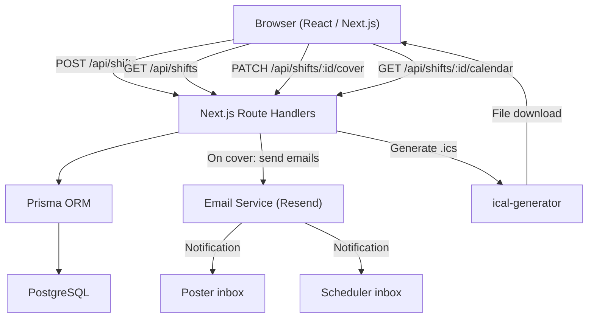

# ShiftSwapper Backend Design

## 1. Overview

This document describes the backend architecture for ShiftSwapper: the data models, API surface, business logic, notification system, calendar invite generation, error handling strategy, and future-proofing considerations. The source requirements live in `shiftswapper.md`.

---

## 2. Tech Stack

| Concern           | Choice                              | Rationale                                                                 |
|-------------------|-------------------------------------|---------------------------------------------------------------------------|
| Runtime           | Node.js + TypeScript                | Ubiquitous, strong typing, large ecosystem                                |
| Framework         | Next.js (App Router + Route Handlers) | Collocates API and React UI; no separate server to deploy for MVP       |
| Database          | PostgreSQL (prod) / SQLite (local)  | Simple relational schema; Prisma makes both interchangeable               |
| ORM               | Prisma                              | Type-safe queries, first-class migration tooling                          |
| Email             | Resend (or SendGrid)                | Transactional email via API; no SMTP configuration needed                 |
| Calendar invites  | ical-generator (npm)                | RFC 5545 compliant .ics generation; works with Outlook, Apple, Google     |
| Validation        | Zod                                 | Schema-first validation; pairs well with TypeScript                       |

---

## 3. Data Model

### 3.1 shifts

The central table. One row per posted shift.

| Column        | Type        | Constraints              | Notes                                         |
|---------------|-------------|--------------------------|-----------------------------------------------|
| id            | UUID        | PK, DEFAULT gen_random_uuid() |                                          |
| poster_name   | VARCHAR     | NOT NULL                 |                                               |
| poster_email  | VARCHAR     | NOT NULL                 | Never exposed to the browser                  |
| poster_phone  | VARCHAR     | NULL                     | Optional; reserved for future SMS             |
| location      | VARCHAR     | NOT NULL                 | Validated against the allowed locations list  |
| role          | VARCHAR     | NOT NULL                 | "Pharmacist" for MVP; validated against enum  |
| shift_date    | DATE        | NOT NULL                 |                                               |
| start_time    | TIME        | NOT NULL                 |                                               |
| end_time      | TIME        | NOT NULL                 | Must be after start_time (enforced in API)    |
| status        | VARCHAR     | NOT NULL, DEFAULT 'open' | open / covered / cancelled                    |
| coverer_name  | VARCHAR     | NULL                     | Populated when shift is covered               |
| coverer_email | VARCHAR     | NULL                     | Populated when shift is covered               |
| created_at    | TIMESTAMPTZ | NOT NULL, DEFAULT now()  |                                               |
| covered_at    | TIMESTAMPTZ | NULL                     | Populated when shift is covered               |

### 3.2 settings

A single-row configuration table.

| Column          | Type        | Notes                                          |
|-----------------|-------------|------------------------------------------------|
| id              | UUID        | PK                                             |
| scheduler_email | VARCHAR     | Receives coverage notification emails          |
| timezone        | VARCHAR     | DEFAULT 'America/Chicago'; used for .ics files |
| created_at      | TIMESTAMPTZ |                                                |
| updated_at      | TIMESTAMPTZ |                                                |

For MVP this row is seeded manually. A future settings UI will allow the admin to update it.

### 3.3 users (future placeholder)

Not implemented in MVP. Schema documented here so the shifts table can be extended with a FK without a redesign.

| Column            | Type        | Notes                                            |
|-------------------|-------------|--------------------------------------------------|
| id                | UUID        | PK                                               |
| name              | VARCHAR     | NOT NULL                                         |
| email             | VARCHAR     | UNIQUE, NOT NULL                                 |
| phone             | VARCHAR     | NULL                                             |
| role              | VARCHAR     | 'member' or 'admin'                              |
| allowed_locations | JSONB       | Array of location strings this user may cover    |
| allowed_roles     | JSONB       | Array of role strings this user may cover        |
| created_at        | TIMESTAMPTZ |                                                  |

When auth is introduced, the shifts table gains `posted_by_user_id UUID REFERENCES users(id)`.

---

## 4. Reference Data

Locations and roles are currently static. They are defined as constants in the codebase (not database rows) for MVP, making them easy to extend later by moving them to a database table.

### Locations

```
Red Pharmacy
CSC Pharmacy
Shapiro Pharmacy
Whittier Pharmacy
Green Pharmacy
Speciality Pharmacy
Brooklyn Park Pharmacy
St. Anthony Pharmacy
Richfield Pharmacy
North Loop Pharmacy
```

### Roles (MVP)

```
Pharmacist
```

Both lists are returned by dedicated API endpoints so the frontend never hardcodes them.

---

## 5. API Endpoints

### 5.1 Reference Data

| Method | Path           | Auth Required | Description                        |
|--------|----------------|---------------|------------------------------------|
| GET    | /api/locations | No            | Returns the array of location names |
| GET    | /api/roles     | No            | Returns the array of role names     |

**GET /api/locations response:**
```json
{ "locations": ["Red Pharmacy", "CSC Pharmacy", "..."] }
```

### 5.2 Shifts

| Method | Path                      | Auth Required | Description                                          |
|--------|---------------------------|---------------|------------------------------------------------------|
| POST   | /api/shifts               | No (MVP)      | Create a new open shift posting                      |
| GET    | /api/shifts               | No            | List open shifts; filterable by date range, location, role |
| GET    | /api/shifts/:id           | No            | Get full details for a single shift                  |
| PATCH  | /api/shifts/:id/cover     | No (MVP)      | Mark shift as covered; triggers notifications        |
| GET    | /api/shifts/:id/calendar  | No            | Download .ics file for a covered shift               |

#### POST /api/shifts

Request body:
```json
{
  "poster_name": "Jane Smith",
  "poster_email": "jane@example.com",
  "poster_phone": "612-555-0100",
  "location": "Shapiro Pharmacy",
  "role": "Pharmacist",
  "shift_date": "2026-03-15",
  "start_time": "07:00",
  "end_time": "15:00"
}
```

Response (201):
```json
{
  "id": "uuid",
  "status": "open",
  "location": "Shapiro Pharmacy",
  "role": "Pharmacist",
  "shift_date": "2026-03-15",
  "start_time": "07:00",
  "end_time": "15:00",
  "poster_name": "Jane Smith",
  "created_at": "..."
}
```

Note: `poster_email` and `poster_phone` are NOT returned in any response body.

#### GET /api/shifts

Query parameters:

| Param     | Type   | Description                                    |
|-----------|--------|------------------------------------------------|
| from      | date   | Start of date range (ISO, inclusive)           |
| to        | date   | End of date range (ISO, inclusive)             |
| location  | string | Filter to a specific location                  |
| role      | string | Filter to a specific role                      |

Only shifts with `status = 'open'` are returned by default.

#### PATCH /api/shifts/:id/cover

Request body:
```json
{
  "coverer_name": "Alex Johnson",
  "coverer_email": "alex@example.com"
}
```

Response (200): Updated shift object (same shape as POST response, with `status: "covered"` and `coverer_name` included).

### 5.3 Settings (future, admin-only)

| Method | Path          | Auth Required | Description                       |
|--------|---------------|---------------|-----------------------------------|
| GET    | /api/settings | Admin only    | Read current settings             |
| PATCH  | /api/settings | Admin only    | Update scheduler email, timezone  |

---

## 6. Business Logic

### 6.1 Shift Creation Validation

Enforced server-side via Zod schema before any database write:

- `poster_name`: non-empty string
- `poster_email`: valid email format, required
- `poster_phone`: optional; if present, must match phone number pattern
- `location`: must be one of the 10 allowed strings
- `role`: must be one of the allowed role strings
- `shift_date`: valid ISO date, must be today or in the future
- `start_time`: valid HH:MM format
- `end_time`: valid HH:MM format, must be strictly after `start_time`

### 6.2 Cover Flow (PATCH /api/shifts/:id/cover)

Executed in a single database transaction where possible:

1. Fetch shift by ID. Return 404 if not found.
2. Check `status === 'open'`. Return 409 if already covered or cancelled.
3. Validate `coverer_name` (required) and `coverer_email` (required, valid email format).
4. Update the row: set `status = 'covered'`, `coverer_name`, `coverer_email`, `covered_at = now()`.
5. Fetch `scheduler_email` from the settings table.
6. Send two notification emails (see Section 7). Email failure is logged but does NOT roll back the database update -- the shift remains covered.
7. Return the updated shift object.

---

## 7. Notification System

### Trigger

Both emails are sent immediately after a successful cover action in step 6 of the cover flow.

### Email 1: To the original poster

- **To:** `poster_email` (from database, never from browser)
- **Subject:** `Your shift on [date] at [location] has been covered`
- **Body (plain text):**
  ```
  Hi [poster_name],

  Good news -- [coverer_name] will be covering your shift:

    Date:     [shift_date]
    Time:     [start_time] - [end_time]
    Location: [location]
    Role:     [role]

  Please confirm the change with your scheduler.

  -- ShiftSwapper
  ```

### Email 2: To the scheduler

- **To:** `scheduler_email` (from settings table)
- **Subject:** `Shift coverage alert: [date] at [location]`
- **Body (plain text):**
  ```
  Hi,

  A shift has been picked up via ShiftSwapper. Please update the schedule.

    Date:      [shift_date]
    Time:      [start_time] - [end_time]
    Location:  [location]
    Role:      [role]
    Originally posted by: [poster_name]
    Covered by:           [coverer_name] ([coverer_email])

  -- ShiftSwapper
  ```

### Implementation Notes

- Email is sent via the Resend (or SendGrid) API using their Node.js SDK.
- For MVP, sending is awaited synchronously in the request handler. If sending fails, the error is logged and a warning is included in the API response, but the 200 status is preserved.
- Future improvement: move email dispatch to a background job queue (e.g., BullMQ + Redis) so failures can be retried without blocking the HTTP response.

---

## 8. Calendar Invite Generation

### Endpoint

`GET /api/shifts/:id/calendar`

### Behavior

1. Fetch the shift. Return 404 if not found.
2. Return 400 if `status !== 'covered'` (no need to generate an invite for an unclaimed shift).
3. Combine `shift_date` + `start_time` / `end_time` into full datetime objects using the timezone from the settings table (default: `America/Chicago`).
4. Use `ical-generator` to produce a calendar event:
   - `SUMMARY`: `Pharmacy Shift - [location] ([role])`
   - `DTSTART`: shift start datetime
   - `DTEND`: shift end datetime
   - `LOCATION`: location string
   - `DESCRIPTION`: `Covered via ShiftSwapper. Originally posted by [poster_name].`
   - `STATUS`: `CONFIRMED`
5. Set response headers:
   - `Content-Type: text/calendar; charset=utf-8`
   - `Content-Disposition: attachment; filename="shift-[date].ics"`
6. Stream the `.ics` string as the response body.

### Calendar Compatibility

| Calendar App    | Method                                      |
|-----------------|---------------------------------------------|
| Apple Calendar  | Download .ics; iOS/macOS opens it natively  |
| Outlook         | Download .ics; double-click to import       |
| Google Calendar | Client-side: construct a `calendar.google.com/calendar/render?action=TEMPLATE&...` URL from shift data. No server involvement needed. |

The Google Calendar deep link is built entirely on the frontend from the shift details already in the API response. No server endpoint is needed for it.

---

## 9. Error Handling

All error responses use a consistent JSON envelope:

```json
{
  "error": "Human-readable description of what went wrong",
  "code": "MACHINE_READABLE_CODE"
}
```

For validation errors, a `fields` array is included:

```json
{
  "error": "Validation failed",
  "code": "VALIDATION_ERROR",
  "fields": [
    { "field": "end_time", "message": "Must be after start_time" }
  ]
}
```

### Error Code Reference

| Code                  | HTTP Status | When Used                                              |
|-----------------------|-------------|--------------------------------------------------------|
| VALIDATION_ERROR      | 422         | Request body fails schema validation                   |
| SHIFT_NOT_FOUND       | 404         | No shift with the given ID                             |
| SHIFT_ALREADY_COVERED | 409         | Attempt to cover a shift that is already covered       |
| SHIFT_NOT_COVERED     | 400         | Attempt to download .ics for an open (uncovered) shift |
| INTERNAL_ERROR        | 500         | Unexpected server error                                |

---

## 10. Architecture Diagram



---

## 11. Project Structure (suggested)

```
src/
  app/
    api/
      shifts/
        route.ts              # GET (list), POST (create)
        [id]/
          route.ts            # GET (detail)
          cover/
            route.ts          # PATCH (cover)
          calendar/
            route.ts          # GET (.ics download)
      locations/
        route.ts              # GET
      roles/
        route.ts              # GET
      settings/
        route.ts              # GET, PATCH (future)
  lib/
    db.ts                     # Prisma client singleton
    email.ts                  # Email send helpers
    ics.ts                    # Calendar invite generation
    validation.ts             # Zod schemas
    constants.ts              # LOCATIONS, ROLES arrays
prisma/
  schema.prisma
  migrations/
```

---

## 12. Future-Proofing

### Authentication

- Add a `users` table and an auth provider (e.g., NextAuth.js with email magic links, or Clerk for a hosted solution).
- Protect POST/PATCH endpoints with session middleware.
- Add `posted_by_user_id` FK to shifts once users exist.
- The settings endpoint becomes admin-only via role check on `req.user.role`.

### Role and Location Restrictions

- The PATCH cover endpoint adds a pre-check: fetch the authenticated user's `allowed_locations` and `allowed_roles`, and reject with 403 if the shift's values are not in those lists.
- The GET shifts endpoint can filter results to only show shifts the current user is eligible to cover.

### SMS Notifications

- `poster_phone` is already in the schema.
- When SMS is enabled: after the cover update succeeds, call the Twilio (or similar) API alongside the email send.
- Add a `notify_sms` boolean to the settings table to toggle it.

### Background Job Queue

- Replace synchronous email/SMS calls with a job pushed to BullMQ.
- A worker process picks up jobs and handles retries with exponential backoff.
- Prevents notification failures from degrading the HTTP response time or causing timeouts.

### Audit Log

- Add a `shift_events` table:
  - `id`, `shift_id` (FK), `event_type` (created/covered/cancelled), `actor_name`, `actor_email`, `occurred_at`
- Insert a row for every state transition. Provides a paper trail for the scheduler and future admin dashboard.
